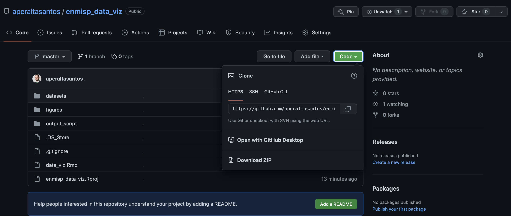

# XIII Encontro Nacional de Médicos de Saúde Pública

### Learning objectives 

- ggplo2 basics in R 
- ggplo2 boxplot 
- ggplo2 lineplot 
- ggplot barchart
- Leaflet
- Maps

### Pre-requisites 
- Install R Studio
- Download zip repository, unzip it (move the unziped file to Descktop) 

